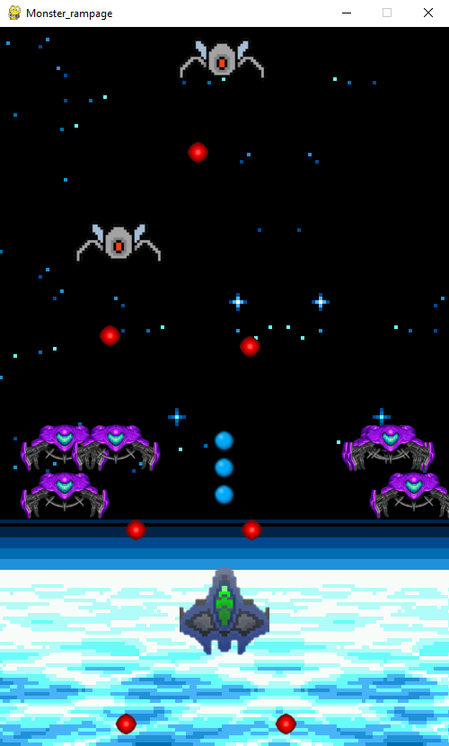

# Space invaders

### Made by Artem Kokorev

* * *

### What's about my game:

#### At first check out screenshots from my game:

  

### The point of my project is to make game , similar to space invaders.

#### When i got an aim to make pygame game with my knowledge,I remembered about space invaders.

#### Because in that game is contained : movement , level creation , and bullet collision

## A bit about realization:

In my work , I have not used any uber rare special moves

But some one can find interesting that I have own timer, ran by 'while' cycle

And I find interesting my music volume fixer, which realization you can check in raw code

As for me, I dont think I have any more secrets

A bit about my code's environment:

Class Cannon is responsible for player's spaceship and it's movement

Several classes Bullets are responsible for enemy's and players bullets

Class Enemy responds for all enemies movement and lives including boss

Functions as show_end,show_intro and show_defeat show menus when battle ends

Additional classes and functions as load_level and Background help program work properly as I want

But you can always write me in social media below, in case of any questions:

*   [vk](https://vk.com/kokorev_artem)
*   [instagram](https://www.instagram.com/flirtmaster2014)
*   [twitter](https://twitter.com/bM1OOSkhve8YwCK)

## Last thing , technologies and requirements

As I said in README and presentation, I used only pygame , sys and random libraries , to make code readable and installable for all kind of programmers

In addition to ordinary tools from pygame, I used mixer to play music

All other libraries I used with their all known technologies